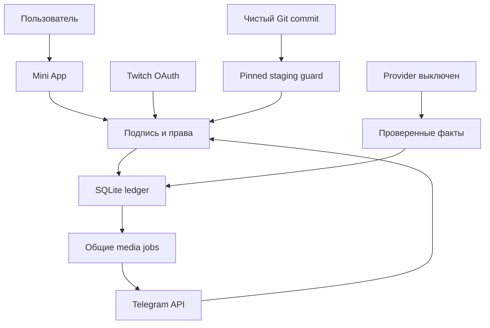

# P19 — модель угроз Mini App

## Краткий итог

Обзор P01–P18 относительно `3f4fec509b0d630d9c1a3e39aa9f6384a866b36e` выявил один воспроизведённый дефект: общий XFO запрещал iframe приложения. Исправление ограничено HTML `/app`: точный CSP origin `https://web.telegram.org`, остальные поверхности сохраняют DENY. Независимый обзор не обнаружил других подтверждённых обходов в прослеженных путях. Это не доказательство отсутствия всех уязвимостей.

## Объём и допущения

Python/aiogram/aiohttp и браузерный JavaScript; один SQLite ledger и Volume. Интернет видит оболочку, API требует свежий подписанный Telegram initData. Первый выпуск работает с денежными операциями OFF. Эти условия прямо заданы владельцем; повторное согласование контекста не требуется. Production, реальные OAuth/платежи/получатели, полный исторический аудит и аудит поставщиков исключены. Server SLA неизвестна; пять личных слотов её не определяют. Merchant, XTR, месяц и legal owner inputs остаются отдельными gates.

## Система

### Компоненты

`main.py` создаёт aiogram, OAuth/aiohttp и PreviewManager. `mini_app_web.py` устанавливает оболочку/assets/API; `mini_app_auth.py` проверяет подпись. `database.py` и `billing_store.py` используют общий ledger. `mini_app_billing.py` безусловно блокирует первый денежный checkout. Build/deploy через `scripts/staging_deploy.py` читает только Git archive чистого commit и pinned target. TEMP fixture и fake SDK не входят в live auth.

### Потоки и границы

- Интернет → API: JSON/Telegram identity по HTTPS, размер/тип/дубликаты/freshness/HMAC; авторитет — проверенный `user.id`, а не клиентский actor/mode/paid (`verified_identity_payload`).
- Пользователь → SQLite: tracking/filters/folders/video/history/placements; own IDs, write lock и BEGIN IMMEDIATE, CAS, серверные50/200/5 (`database.py`, `mini_app_viewer.py`).
- OAuth/Twitch/Telegram → placement: случайный одноразовый state, verified Twitch identity, DB owner/deadline/cancel, live permission checker; ticket HttpOnly/SameSite/path (`oauth.py`, `oauth_result.py`, `mini_app_streamer.py`).
- Browser/provider → billing: серверный catalog/frozen beneficiary; первый prepare503; будущие canonical facts/attempts/replay/UNKNOWN в общей транзакции (`plan_catalog.py`, `billing.py`, `billing_reconciliation.py`).
- Entitlement → media → Telegram: общая effective SQL, повтор прав перед animation, photo fallback; shared capture и cap2, общий send budget (`entitlements.py`, `preview_manager.py`, `live_post.py`).
- Текст/URL → DOM: textContent/createElement, allowlisted legal nodes, public HTTPS/mailto guards, scoped storage без секретов (`components.js`, `support.js`, `legal_documents.py`).
- Оператор → staging artifact: clean branch/SHA, target/Volume/domain/replica, archive, suite и повтор identity после ожидания (`staging_deploy.py`).

## Активы и цели

| Актив | Возможный вред | Цель |
|---|---|---|
| Telegram/Twitch identity и токены | чужая привязка, утечка | C/I |
| Tracking/каналы/история/HTML | раскрытие или потеря данных | C/I/A |
| Ledger/frozen grants | чужие права, повторная активация | I |
| Capture/render/send budget | задержки уведомлений | A |
| Secrets/backup/artifact | контроль сервиса, утечка | C/I |

## Противник

Удалённый посетитель может отправлять malformed/replayed HTTP и клиентские флаги; собственный Telegram пользователь может менять свои IDs и повторять callbacks. Он не владеет bot token, Fernet key, Railway/Git или чужим подписанным initData. Компрометация этих операторских секретов существенно повышает риск и не моделируется как обычный анонимный запрос.

## Входные поверхности

| Поверхность | Граница | Доказательство |
|---|---|---|
| `/app`/assets | browser origin → shell | `mini_app_web.py`, строгий CSP/allowlist |
| `/app/api/*` | signed user → own SQL | `mini_app_auth.py`, viewer/streamer/billing modules |
| OAuth callback/result | внешний state → verified identity | `oauth.py`, `oauth_result.py` |
| Старые aiogram callbacks | actor → media/placement | `handlers/streams.py`, common capabilities |
| Provider callbacks/attempts | notice → canonical fact | `payment_web.py`, reconciliation; live route OFF |
| Legal/support URLs | текст → DOM/navigation | `legal_documents.py`, `support.js` |
| Media subprocess/files | external capture → bounded artifact | preview source/capture/render/manager |
| Release/backup | оператор → staging | `staging_deploy.py`, `sqlite_backup.py` |

## Основные пути злоупотребления

1. Подменить actor/paid/mode → чужой API ID → получить данные/Plus; останавливается HMAC и own lookup.
2. Повторить provider callback или потерянный create → новый POST/месяц; durable attempts/unique fact и UNKNOWN не повторяют денежную операцию.
3. Перепривязать Twitch после оплаты → присвоить Viewer права; beneficiary заморожен, publishing проверяет отдельный placement.
4. Вызвать старый togglepreview или выбрать шестого/offline → animation без Plus; общий effective predicate/серверный CAS и send recheck.
5. Отменить OAuth и открыть старый result URL → ложное подключение; DB owner/status/deadline и ticket scope.
6. Вставить script/небезопасный support URL → перехват identity; DOM allowlist/CSP/URL validation.
7. Заказать много разных capture → задержать обычные уведомления; cap/deferred/photo/send budget, остаточная нагрузка требует измерения.
8. Перепутать Railway target или восстановить старый binary → production/потеря ledger; pinned guard/backup/migration-copy; старый binary не автоматический rollback.

## Таблица угроз

| ID | Источник и предпосылка | Действие | Актив/вред | Контроли | Пробел/рекомендация/обнаружение | Вероятность | Влияние | Приоритет |
|---|---|---|---|---|---|---|---|---|
| TM-001 | Интернет/собственный Telegram actor | чужой ID или paid flag | данные/права | auth/own SQL | отрицательные auth/IDOR tests; считать401/403 без initData logs | low: подпись и ownership | high: чужие данные | medium |
| TM-002 | повтор/таймаут provider | двойная активация | ledger | durable attempts/unique facts/OFF | merchant sandbox ещё NOT TESTED; следить UNKNOWN/manual_review без повтор POST | low: OFF | high: права/деньги | medium |
| TM-003 | прежний buyer/placement | перепривязка/legacy callback/6th | grants/media | frozen SQL/CAS/recheck | реальные animation→photo NOT TESTED; regression suites обязательны | low: common gates | high: чужие права | medium |
| TM-004 | stale OAuth state | чужое/отменённое подключение | identity/token | one use/DB cancel/expiry/ticket | native return NOT TESTED; считать причины исходов без токена | low: state и owner | high: identity | medium |
| TM-005 | управляемый URL/текст | script/navigation injection | identity/данные | escaped nodes/HTTPS/mailto/CSP | разрешённый iframe теперь exact origin; probes foreign blocked | low: нет raw HTML | high: секреты | medium |
| TM-006 | много разрешённых viewers | media saturation | availability | cap2/deferred/photo/budget | workload SLA неизвестна; RESOURCE_STOP честно сохранять | medium: shared сервер | medium: задержки | medium |
| TM-007 | ошибка оператора | чужой deploy/restore | artifact/ledger | target/clean SHA/online backup | secret backups вне Git; миграция копии и проверка фактического artifact | low: guard | high: данные/production | medium |
| TM-008 | общий header XFO | блокировка Telegram iframe | availability | scoped CSP fix | F1 воспроизведён/исправлен; оба origin probes, остальные DENY | high до fix, low после | medium: вход не работает | low после fix |

## Калибровка

Critical: массовая утечка bot/Fernet key или pre-auth управление процессом. High: подтверждённый чужой ledger/identity доступ либо обход денежных OFF. Medium: ограниченная media недоступность или conditional риск с действующими контролями. Low: безвредная информация о версии или исправленный iframe gate. Для этой версии денежные риски понижаются OFF, но включение provider требует новой оценки.

## Фокус ручного обзора

| Путь | Причина | Угрозы |
|---|---|---|
| `bot/mini_app_auth.py` | единственный вход identity |001 |
| `bot/database.py`/`entitlements.py` | SQL/CAS/beneficiary |001,003,007 |
| `bot/billing_store.py`/`billing_migrations.py` | atomic ledger |002,007 |
| `bot/billing_reconciliation.py`/providers | UNKNOWN/replay/canonical amount |002 |
| `bot/mini_app_billing.py`/`main.py` | OFF/live route |002 |
| `bot/oauth.py`/`oauth_result.py` | verified state/cookie |004 |
| `bot/mini_app_streamer.py` | own permission/placement |003,004 |
| `bot/handlers/streams.py`/`preview_manager.py`/`live_post.py` | legacy и final send |003,006 |
| `bot/mini_app_web.py`/`mini_app_ui/support.js` | iframe/DOM/URL |005,008 |
| `scripts/staging_deploy.py`/`sqlite_backup.py` | artifact/backup |007 |

## Пределы и проверка полноты

Каждая найденная поверхность и граница отражены выше; runtime отделён от TEMP QA и release tooling. Независимый read-only отчёт сохранён отдельно. Header/auth/admin/OAuth/legal focused31tests/44subtests PASS; actual exact-origin probes Chromium/WebKit PASS, foreign blocked, external0. Screenshot WebKit снимается через raw protocol: стандартный screenshot сам вставляет stylesheet и создаёт CSP warning, не требующий ослабления продукта. Полный suite/backup/deploy записываются в RELEASE-GATE; native/merchant/реальные send ещё NOT TESTED. No new claim of production audit or legal approval.
